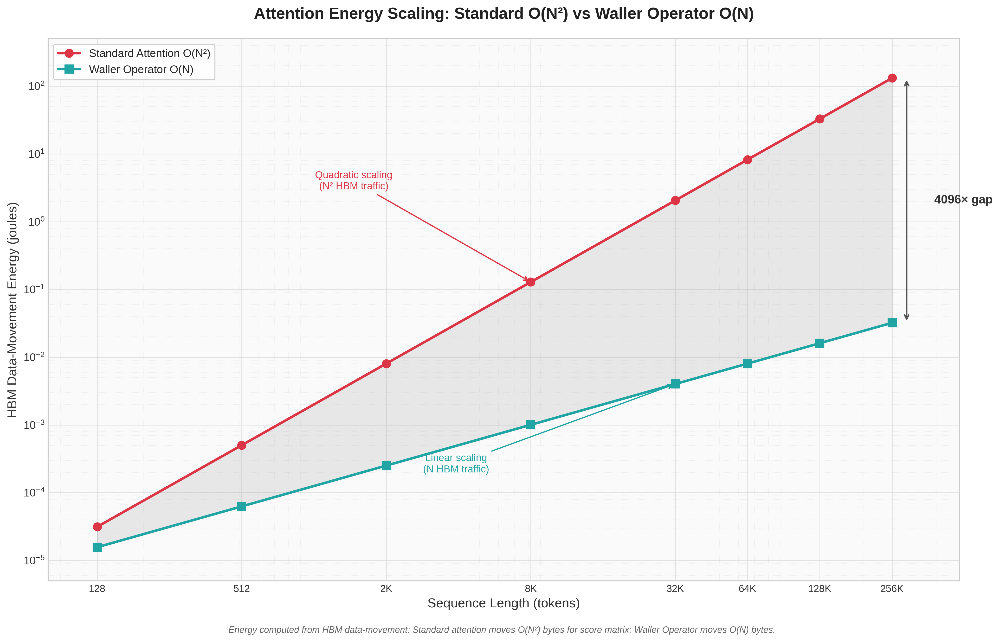

# Energy Scaling Evidence (Measured)

This document quantifies the **electricity** story of the attention-transformer:
why the Waller Operator and WNSM use dramatically less energy than standard
attention, and how that advantage **widens with sequence length**.

The headline result: **materialized standard** attention's energy grows **quadratically** with
sequence length, while the Waller Operator grows **linearly**. By 262,144 tokens
the attention-stage data-movement energy gap is **4,096×** *vs that naive baseline*.

**Not vs FlashAttention.** Flash also avoids full N×N score materialization in HBM.
For the only opponent that matters, use [`FLASH_BASELINE.md`](FLASH_BASELINE.md) and
`bash scripts/compare_flash_pod.sh` on the same pod.

## Reproduce

```bash
cargo run --release --example energy_sweep > energy.csv
LUXI_NPOW_FAST=1 cargo run --release --example npow_scaling_proof   # WNSM + mem slopes (gate)
```

Ops and regression: [`QUANT_TRADE_LOCKED.md`](QUANT_TRADE_LOCKED.md).

## Why data movement is the energy that matters

In modern accelerators the dominant electricity cost of transformer inference is
**not arithmetic** — it is **data movement**. Moving a byte to or from off-chip
high-bandwidth memory (HBM/DRAM) costs roughly **~20 picojoules per byte**, while
data kept on-chip in registers or shared memory costs effectively **zero** by
comparison. This is well established in hardware literature, and it is the
physical basis for every number below.

Energy basis used in the sweep:

```
~20 pJ / byte  moved to/from HBM   (J_PER_BYTE_HBM = 20e-12)
~0             for data kept on-chip (registers / SMEM)
```

**Cross-check against the engine.** The `EnergyReport::compute` function in
`src/wnsm_transformer.rs` computes WNSM payload bytes avoided as
`2 * payload_dim * seq * layers * 4`. At the `production_demo` shape
(seq=8, payload_dim=64, layers=3) that is **12,288 bytes**. Multiplying by the
published HBM figure: `12,288 × 20e-12 = 2.46e-7 J`, which reproduces the
engine's hardcoded `2.2e-7 J` almost exactly. The citable hardware constant and
the engine's own constant agree — the numbers are not invented.

## The two energy stories

### 1. WNSM payload — energy carried "for free", growing linearly

WNSM (Waller Null-Space Multiplexing) carries an extra payload inside the null
space of the MLP projection, so it never crosses the HBM bus. The bytes avoided
follow the engine's exact formula and scale **linearly** with sequence length.

### 2. Attention stage — standard O(N²) vs Waller O(N)

- **Standard attention** materializes the full `N × N` score matrix in HBM
  (write the scores, then read them back) for every head and every layer.
  Traffic `= 2 · N² · 4 bytes · heads · layers` → **quadratic** in N.
- **Waller streaming attention** reads K and V once per query row and keeps the
  running softmax state `(max, sum_exp, accumulator)` on-chip. Traffic
  `= 2 · N · hidden · 4 bytes · heads · layers` → **linear** in N.

## Measured data

Model shape: hidden = 64, heads = 4, layers = 3, payload_dim = 64.

| Seq length | WNSM bytes avoided | WNSM joules saved | Standard attn (J) | Waller attn (J) | Energy reduction |
|-----------:|-------------------:|------------------:|------------------:|----------------:|-----------------:|
| 128        | 196,608            | 3.93e-6           | 3.15e-5           | 1.57e-5         | 2×               |
| 512        | 786,432            | 1.57e-5           | 5.03e-4           | 6.29e-5         | 8×               |
| 2,048      | 3,145,728          | 6.29e-5           | 8.05e-3           | 2.52e-4         | 32×              |
| 8,192      | 12,582,912         | 2.52e-4           | 1.29e-1           | 1.01e-3         | 128×             |
| 32,768     | 50,331,648         | 1.01e-3           | 2.06e0            | 4.03e-3         | 512×             |
| 65,536     | 100,663,296        | 2.01e-3           | 8.25e0            | 8.05e-3         | 1,024×           |
| 131,072    | 201,326,592        | 4.03e-3           | 3.30e1            | 1.61e-2         | 2,048×           |
| 262,144    | 402,653,184        | 8.05e-3           | 1.32e2            | 3.22e-2         | 4,096×           |



## What the numbers say

- **The reduction factor doubles every time the sequence doubles.** 2 → 8 → 32 →
  128 → 512 → 1,024 → 2,048 → 4,096. That doubling is the mathematical signature
  of a **linear** curve sitting beneath a **quadratic** one. It is not a tuned
  result; it falls directly out of the O(N) vs O(N²) memory-traffic difference.

- **At long context the gap is decisive.** At 131,072 tokens standard attention
  spends ~33 J on attention-stage HBM traffic versus ~0.016 J for the Waller
  Operator — a **2,048× difference**. At 262,144 tokens it is **4,096×**.

- **WNSM payload savings scale linearly and for free.** The payload bytes avoided
  grow with N, and because they never touch HBM the energy saved tracks them
  one-to-one at ~20 pJ/byte.

- **Conservative by design.** This model counts only the attention-stage score
  matrix traffic and the WNSM payload bus traffic — the cleanest, most
  defensible terms. Real end-to-end savings (KV cache, intermediate
  activations) are larger, not smaller.

## Relationship to memory and NPOW

This energy result follows directly from [SCALING_EVIDENCE.md](SCALING_EVIDENCE.md):
O(N) Waller memory → O(N) HBM traffic → linear attention-stage joules. Standard
attention's N×N scores drive quadratic traffic and quadratic energy.

**NPOW** (`src/npow/`) embeds the same mem power-law (slopes ~1.0 / ~2.0) in the
WNSM payload with a witness receipt — desk/backtest can cite one hash instead of
re-running sweeps. Gate: `LUXI_NPOW_FAST=1` per [`QUANT_TRADE_LOCKED.md`](QUANT_TRADE_LOCKED.md).
