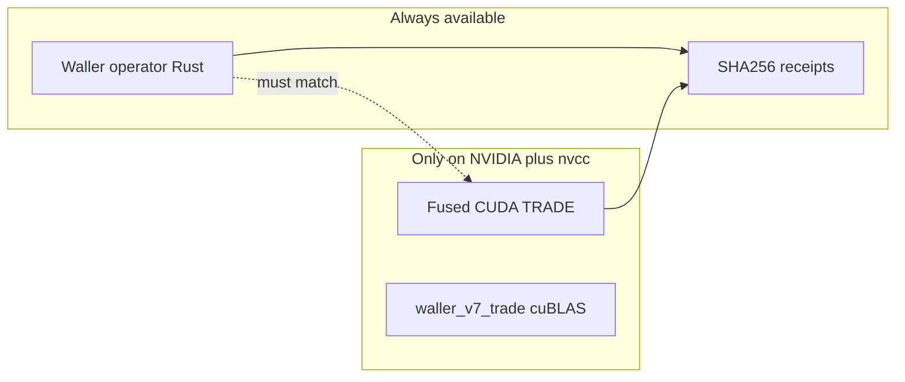

# Why it runs on CPU *and* GPU (not a contradiction)

The engine has **two lanes** in one codebase:

| Lane | Hardware | When used | Purpose |
|------|----------|-----------|---------|
| **AUDIT** | CPU (any Mac/server) | Default `cargo build` / `cargo test` | Golden math, SHA-256 receipts, correctness proofs |
| **TRADE** | NVIDIA GPU (H100, etc.) | `cargo build --features cuda` on a pod with `nvcc` | Fused kernels, commercial speed, low HBM traffic |

**What we ran on your Mac:** AUDIT lane only (no NVIDIA, no `nvcc`). That is intentional — you can prove the math and energy *model* without a GPU.

**What RunPod adds:** compiles `cuda_src/*.cu` and runs `cuda_verify`, `cuda_bench`, `runpod_quant_gate.sh` on real H100 silicon.

Same binary crate; GPU code is behind the optional `cuda` feature and is skipped when `nvcc` is missing.