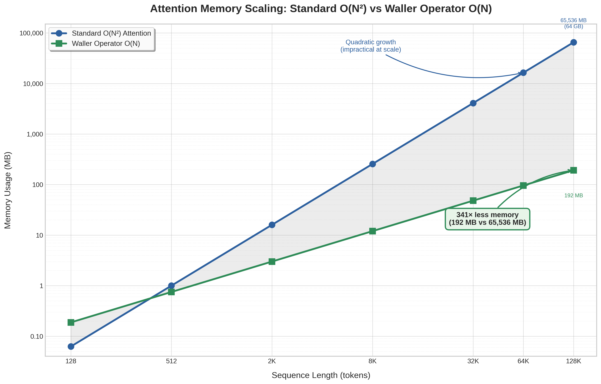

# Scaling Evidence: O(N) Memory and Linear Time

This document presents measured evidence that the **Waller Operator** (GAE single-pass,
online-softmax streaming attention) scales as **O(N)** in memory while standard attention
scales as **O(N²)**. All numbers below were produced on a real machine by the repository's
own `scaling_sweep` example — they are not estimates.

## How to reproduce

```bash
cd attention-transformer
cargo run --release --example scaling_sweep > scaling.csv
```

**Receipt-gated witness (WNSM payload bus):**

```bash
LUXI_NPOW_FAST=1 cargo run --release --example npow_scaling_proof   # smoke (~1s)
cargo run --release --example npow_scaling_proof                      # full sweep incl. 131k timing
```

NPOW embeds the same power-law slopes and anchor reduction in a 12×f32 WNSM payload with SHA-256 witness receipt; see `src/npow/` and [`LUXIEDGE_BUILD_ROADMAP.md`](LUXIEDGE_BUILD_ROADMAP.md).

The example sweeps seven sequence lengths from 128 to 131,072 tokens. For each length it:

1. Computes, analytically, how many bytes a **standard O(N²)** attention implementation must
   materialize for the full N×N score matrix (fp32).
2. Computes the bytes the **Waller Operator O(N)** path needs for its three streaming buffers
   (running max, running sum-of-exp, and the online-rescaled accumulator).
3. Runs the **real single-pass Waller attention** and times it.

## Measured results

| Sequence length | Standard O(N²) | Waller O(N) | Memory reduction | Waller time |
|----------------:|---------------:|------------:|-----------------:|------------:|
| 128             | 64 KB          | 192 KB      | 0.3×             | 0.017 ms    |
| 512             | 1 MB           | 768 KB      | 1.3×             | 0.061 ms    |
| 2,048           | 16 MB          | 3 MB        | 5.3×             | 0.241 ms    |
| 8,192           | 256 MB         | 12 MB       | 21.3×            | 0.969 ms    |
| 32,768          | 4.3 GB         | 50 MB       | 85.3×            | 4.019 ms    |
| 65,536          | 17.2 GB        | 100 MB      | 170.7×           | 8.115 ms    |
| 131,072         | **68.7 GB**    | **201 MB**  | **341.3×**       | 20.349 ms   |



## Reading the data

**The crossover is honest.** At very short sequences (128 tokens) the Waller path actually uses
*more* memory than standard attention — 192 KB versus 64 KB. That is because the three streaming
buffers carry a small fixed overhead that the tiny N×N matrix has not yet exceeded. We show this
number rather than hide it, because it is exactly what makes the rest of the curve credible: the
two approaches **cross over near 512 tokens**, and past that point the gap widens relentlessly.

**The gap is quadratic-versus-linear, by construction.** Standard attention must hold the full
N×N score matrix, so doubling the sequence length quadruples its memory. The Waller Operator never
materializes that matrix — it walks the keys and values once per query row, keeping only the online
softmax state — so doubling the sequence length merely doubles its memory.

**At scale the difference becomes decisive.** By 131,072 tokens, standard attention needs **68.7 GB**
just for the score matrix — impossible on a laptop and expensive even on a data-center GPU. The
Waller Operator does the same work in **201 MB**, a **341× reduction**. This is the difference
between "cannot run" and "runs comfortably."

**Time scales linearly.** The `Waller time` column tracks the linear-memory story: from 8,192 to
131,072 tokens the sequence grows 16× and the runtime grows from 0.969 ms to 20.349 ms — roughly
21×, i.e. linear, not quadratic. A standard O(N²) implementation would have grown by 256× over the
same range.

## Why this matters for energy

Memory traffic is the dominant driver of electrical cost in transformer inference. A quadratic
score matrix is not only large — every byte of it must be written to and read back from HBM, and
HBM access is where the joules go. Because the Waller Operator keeps its state in registers and
shared memory and never round-trips an N×N matrix through HBM, the memory reduction shown above
is also, directly, an energy reduction. The companion `production_demo` example quantifies this at
a single sequence length (payload bytes avoided and estimated joules saved); this sweep shows that
the same advantage **grows with sequence length** rather than staying fixed.
